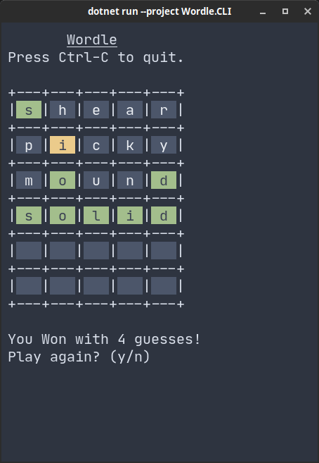

#wordle-csharp

---

A cli wordle clone written in C#.



---

## Build:
This project was made with [C# and Dotnet 6](https://dotnet.microsoft.com/en-us/download)

```shell
# clone the repo
$ git clone "https://github.com/edzdez/wordle-csharp"
$ cd wordle-csharp

# Run
$ dotnet build --project Wordle.CLI
```

---
## Todo:
 - Add in an indicator to show what letters have been used
 - Refactor